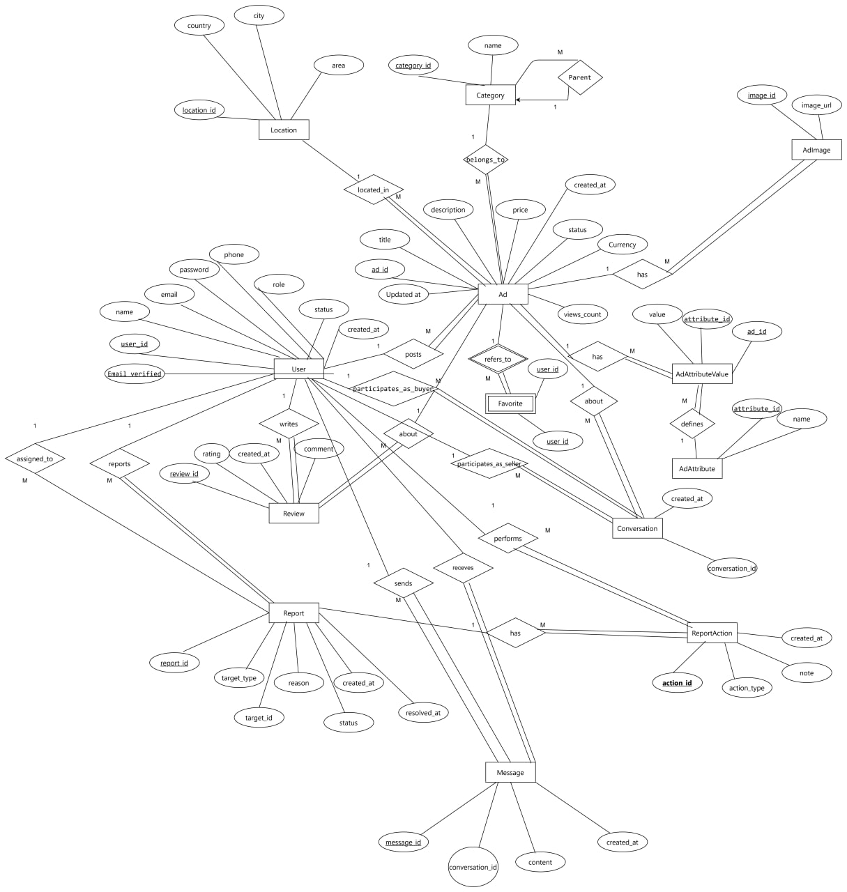
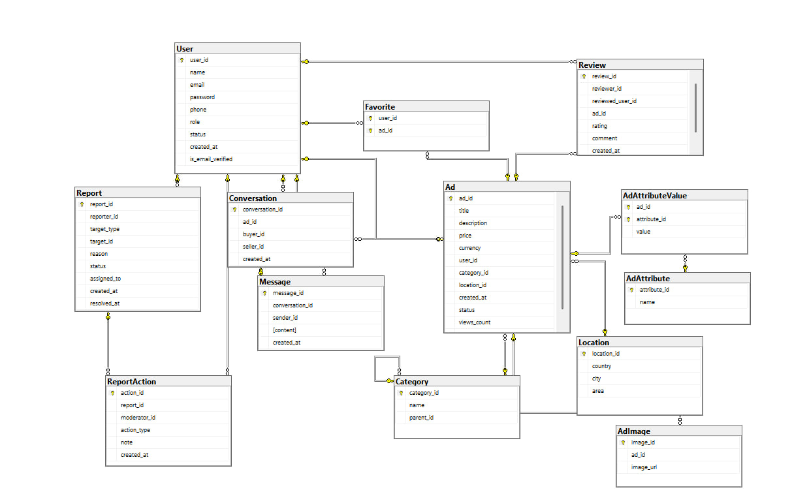

# Advanced-Classified-Ads-DB

A C2C classified ads platform built on Microsoft SQL Server, engineered with a focus on advanced database internals — stored procedures, triggers, user-defined functions, indexing optimization, role-based access control, and audit logging.

---

## Table of Contents

- [Database Schema](#️-database-schema)
- [Features](#️-features)
- [Stored Procedures](#-stored-procedures-20)
- [User-Defined Functions](#-user-defined-functions-15)
- [Triggers](#-triggers-5)
- [Views](#-views-5)
- [Role-Based Access Control](#-role-based-access-control)
- [Query Optimization & Indexing](#-query-optimization--indexing)
- [Dataset](#️-dataset)
- [Tech Stack](#️-tech-stack)
- [Setup](#-setup)
- [Team](#-team)
- [Project Structure](#-project-structure)
- [System Architecture](#-system-architecture)

---

## Database Schema

The database is named **`ClassifiedAdsDB`** and consists of **13 tables**:

| Table | Description |
|---|---|
| `User` | Platform users with roles (user / moderator / admin) |
| `Category` | Self-referencing category tree (parent → child) |
| `Location` | Country / City / Area hierarchy |
| `Ad` | Core listing entity with status lifecycle |
| `AdImage` | Multiple images per advertisement |
| `AdAttribute` | Flexible attribute definitions |
| `AdAttributeValue` | Key-value pairs linked to ads |
| `Favorite` | User-saved ads (composite PK) |
| `Conversation` | Buyer-seller chat thread per ad |
| `Message` | Individual messages within a conversation |
| `Review` | Seller ratings (1–5) with self-review prevention |
| `Report` | User/ad reports with assignment workflow |
| `ReportAction` | Moderator actions taken on reports |
| `Ad_Audits` | Audit trail for deleted advertisements |

### ERD


### Schema


---

## ⚙️ Features

### User Management
- Registration, login, status updates, and role promotion
- Three roles: **user**, **moderator**, **admin**
- Check constraints enforce valid role values and statuses

### Advertisement Lifecycle
- Status flow: `pending → active → sold / rejected`
- Multi-image support via `AdImage`
- Flexible product attributes via `AdAttribute` / `AdAttributeValue`
- Currency field defaults to **EGP**

### Search & Filtering
- Filter by title (LIKE), category, location, and price range
- Dedicated stored procedure: `SearchAdvertisements`

### Favorites
- Users can save and remove ads from their favorites list
- `Favorite` uses a composite primary key `(user_id, ad_id)`

### Messaging System
- Conversations are scoped to a specific ad between buyer and seller
- Check constraint prevents a user from messaging themselves

### Review & Rating
- Users rate sellers on a 1–5 scale
- Constraint prevents self-reviews (`reviewer_id <> reviewed_user_id`)

### Reporting & Moderation
- Users report ads or users; reports enter a `pending → in_review → resolved` flow
- Moderators can: **warn**, **delete ad**, **ban user**, or **ignore**
- `ReportAction` logs every moderator decision

---

## Stored Procedures (20+)

Grouped by domain:

| Category | Procedures |
|---|---|
| User Management | `RegisterUser`, `LoginUser`, `UpdateUserStatus`, `ChangeUserRole` |
| Advertisement | `AddAdvertisement`, `UpdateAdvertisement`, `DeleteAdvertisement`, `UpdateAdStatus`, `AddAdImage` |
| Category | `AddCategory`, `UpdateCategory`, `DeleteCategory` |
| Search | `SearchAdvertisements` |
| Favorites | `AddToFavorites`, `RemoveFromFavorites` |
| Messaging | `CreateConversation`, `SendMessage` |
| Reviews | `AddReview`, `UpdateReview`, `DeleteReview` |
| Reporting | `CreateReport`, `AssignReportToModerator`, `TakeReportAction` |

---

## User-Defined Functions (15+)

| Category | Functions |
|---|---|
| User | `fn_GetUserAverageRating`, `fn_GetUserAdsCount`, `fn_IsUserActive` |
| Advertisement | `fn_GetAdViewsCount`, `fn_GetAdDetails`, `fn_GetAdsByCategory`, `fn_GetAdsByLocation` |
| Search & Filter | `fn_FilterAdsByPrice`, `fn_SearchAdsByTitle` |
| Favorites | `fn_GetUserFavorites` |
| Messaging | `fn_GetConversationMessages` |
| Reviews | `fn_GetAdReviews`, `fn_GetUserReviews` |
| Reporting | `fn_GetPendingReportsCount` |
| Analytics | `fn_GetTopRatedUsers`, `fn_GetMostActiveUsers` |

---

## Triggers (5)

| Trigger | Event | Description |
|---|---|---|
| `trg_SetAdCreatedAt` | AFTER INSERT on `Ad` | Auto-sets `created_at` if not provided |
| `trg_IncreaseViews` | AFTER UPDATE on `Ad` | Increments `views_count` on every update |
| `trg_PreventNegativePrice` | AFTER INSERT, UPDATE on `Ad` | Rolls back if `price < 0` |
| `trg_protect_ad_delete` | INSTEAD OF DELETE on `Ad` | Role-based delete logic: admin hard-deletes (with audit), moderator soft-deletes, others blocked |
| `trg_AutoResolveReport` | AFTER UPDATE on `Report` | Auto-sets `resolved_at` when status becomes `resolved` |

---

## Views (5)

| View | Purpose |
|---|---|
| `vw_PublicAds` | Active ads with category, location, and seller info — for guests and users |
| `vw_ActiveUsers` | Non-sensitive profile data for active users |
| `vw_ModeratorReports` | Full report details with reporter and assignee names |
| `vw_UserFavorites` | Favorites with ad title, price, and status per user |
| `vw_AuditLogs` | Read-only window into the audit log table |

---

## Role-Based Access Control

Four database roles with scoped permissions:

| Role | Permissions |
|---|---|
| `AdminRole` | Full access to ads, reports, actions, audit log, and user views |
| `ModeratorRole` | SELECT/UPDATE on reports, INSERT/UPDATE on actions, read-only public views |
| `UserRole` | Read public ads/favorites, INSERT into messages, reviews, favorites |
| `GuestRole` | SELECT on `vw_PublicAds` only |

Three logins and database users are pre-created and mapped to roles:
- **Nouran** → `AdminRole`
- **Shahd** → `ModeratorRole`
- **Elaf** → `UserRole`

---

## Query Optimization & Indexing

Five indexes were added to the `Ad` table after identifying bottlenecks from full table scans:

| Index | Columns | Benefit |
|---|---|---|
| `idx_search_ads` | `category_id, location_id, price` | Composite index for multi-condition search |
| `idx_ad_user` | `user_id` | Fast retrieval of a user's own ads |
| `idx_views` | `views_count DESC` | Efficient sorting for analytics reports |
| *(implicit)* | `title` | LIKE-based title search |
| *(implicit)* | `location_id` | Location filter queries |

Each index was validated with before/after query comparisons, eliminating full table scans and reducing execution cost significantly.

---

## Dataset

All data was **generated synthetically using an LLM**, then carefully cleaned and validated to comply with all business logic constraints — including referential integrity, role consistency, status flows, price constraints, and self-review prevention. No third-party dataset repositories were used.

Tables loaded via **BULK INSERT** from CSV files:

`Location` → `Category` → `User` → `Ad` → `AdImage` → `AdAttribute` → `AdAttributeValue` → `Conversation` → `Message` → `Favorite` → `Review` → `Report` → `ReportAction`

---

## Tech Stack

- **DBMS:** Microsoft SQL Server (MSSQL 2022)
- **Language:** T-SQL
- **Tools:** SQL Server Management Studio (SSMS)

---

## Setup

1. Restore the database backup:
```sql
RESTORE DATABASE ClassifiedAdsDB
FROM DISK = 'path\to\classifid_ad.bak'
WITH REPLACE;
```

2. Run scripts in this order:
```
SQLQuery1.sql            → Create all tables
Bulk.sql                 → Load dataset (update CSV paths first)
function.sql             → Create all UDFs
Stored_Procedure.sql     → Create all stored procedures
Tiggers.sql              → Create all triggers
IndexingFinalProject.sql → Create indexes
bef final.sql            → Apply constraints, views, roles, and logins
```

> ⚠️ The CSV files are available in the `dataset/` folder. Update the paths in `Bulk.sql` to match your local machine before running.
---

## Team

| # | Name |
|---|---|
| 1 | Nouran Ehab Abdallah |
| 2 | Basmala Salah Nasr |
| 3 | Elaf Sayed Abdelgawad |
| 4 | Shahd Mohamed Gallal |
| 5 | Mariam Ashraf Hassanin |
| 6 | Mona Helal Abdelnaby Galal |
| 7 | Ebtsam Samer Shabaan |
| 8 | Aya Mohamed Mahmoud |
| 9 | Amira mohamed saad |


---

## Project Structure

```Advanced-Classified-Ads-DB/
├── dataset/                    # Raw CSV files used for BULK INSERT
│   ├── location.csv
│   ├── category.csv
│   ├── user.csv
│   ├── ad.csv
│   ├── ad_image.csv
│   ├── ad_attribute.csv
│   ├── ad_attribute_value.csv
│   ├── conversation.csv
│   ├── message.csv
│   ├── favorite.csv
│   ├── review.csv
│   ├── report.csv
│   └── report_action.csv
├── SQLQuery1.sql               # Core schema (CREATE TABLE statements)
├── Bulk.sql                    # BULK INSERT scripts for all CSV datasets
├── function.sql                # 15+ user-defined functions
├── Stored_Procedure.sql        # 20+ stored procedures
├── Tiggers.sql                 # 5 triggers
├── IndexingFinalProject.sql    # Index definitions + before/after query optimization
├── bef final.sql               # Views, constraints, roles, logins, audit log
├── ERD.jpg                     # Entity-Relationship Diagram
├── Schema.jpg                  # Physical schema diagram
├── C2C_doc.docx                # Full project documentation
└── Entities & attributes.docx  # Entity/attribute reference sheet
```
---

## System Architecture

The database is named **`ClassifiedAdsDB`** and runs on a single Microsoft SQL Server instance. All tables are co-located within one database, with logical separation enforced through role-based access control — each role (Admin, Moderator, User, Guest) is granted access only to the views and tables relevant to their responsibilities.

Data integrity across the system is maintained through:
- **Foreign key constraints** linking all entities
- **Check constraints** enforcing valid values for roles, statuses, prices, and ratings
- **Triggers** handling automated logic at the database layer
- **Views** acting as controlled access points per role
